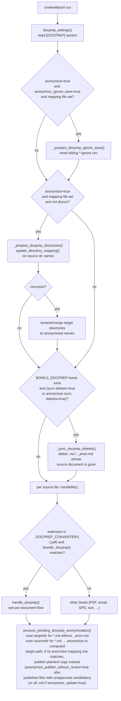
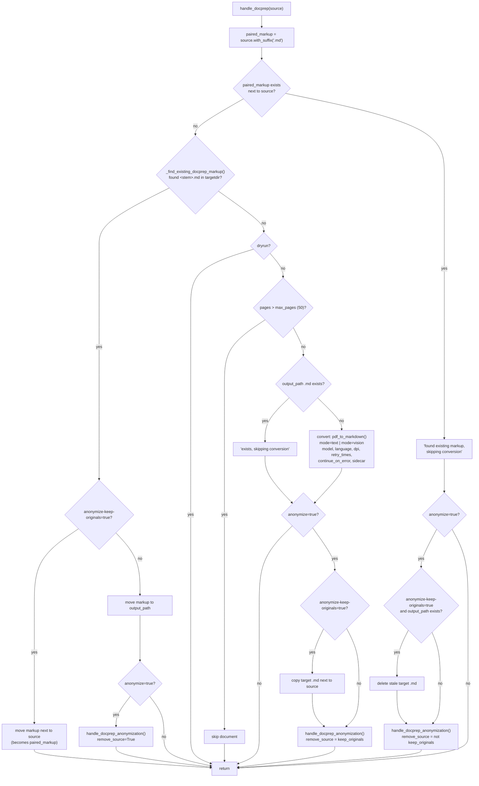
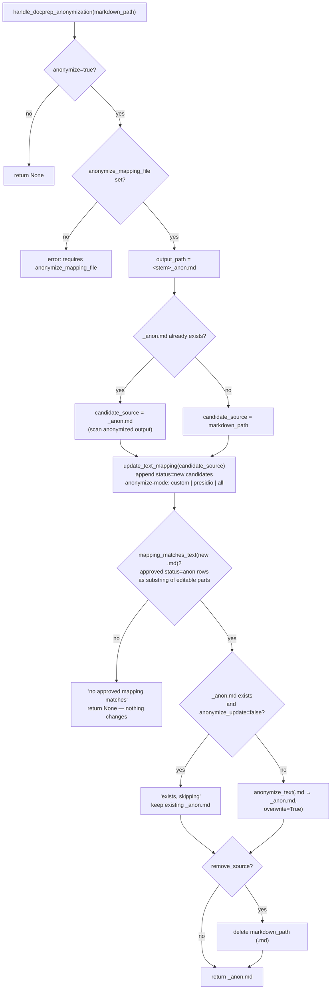

# cinderellasort — DOCPREP flow

Flow of the `[DOCPREP]` pipeline in `cinderellasort.py`, including the
anonymization path and all decision options.

## Run-level flow

## Per-document flow: `handle_docprep()`

## Anonymization flow: `handle_docprep_anonymization()`

## `[DOCPREP]` options

| Option | Default | Effect |
|---|---|---|
| `mode` | `vision` | `text` = pdfplumber text layer; `vision` = multimodal model |
| `model` | `OPENROUTER_PDF_MODEL` | vision model id |
| `language` | `en` | OCR/prompt language |
| `dpi` | `150` | render resolution (vision) |
| `max_pages` | `50` | skip larger PDFs |
| `retry_times` | `3` | model retries per page |
| `continue_on_error` | `false` | keep converting after page errors |
| `sidecar` | `true` | write `<stem>_pdf2md.json` metadata next to source |
| `sync-deletes` | `false` | delete `.md` when source document is gone |
| `anonymize` | `false` | enable the anonymization pipeline |
| `anonymize-mode` | `custom` | `custom` | `presidio` | `all` candidate detection |
| `anonymize_mapping_file` | `<sourcedir>/<dirname>-anon-mapping.csv` | mapping CSV |
| `anonymize_update` | `false` | regenerate existing `_anon.md` (still requires a mapping match) |
| `anonymize-sync-deletes` | `true` | delete `_anon.md` when source document is gone |
| `anonymize-keep-originals` | `false` | keep unanonymized `.md` next to the source PDF |
| `anonymize_publish_without_review` | `false` | publish source `.md` even when unapproved candidates match |
| `anonymize_presidio_model` | `de_core_news_sm` | spaCy model for presidio mode |
| `anonymize_presidio_score_threshold` | `0.5` | presidio confidence cutoff |
| `anonymize_presidio_entities` | built-in list (`all` = registry) | entity allow-list |
| `anonymize_token_length` | `4` | deterministic replacement token length |
| `anonymize_ignore_dictionary` | `false` | ignore dictionary words |
| `anonymize_ignore_numbers` | `false` | ignore values containing digits |
| `anonymize_ignore_emails` | `false` | ignore e-mail candidates |
| `anonymize_ignore_dates` | `false` | ignore date-like candidates |
| `anonymize_ignore_save` | `false` | write filtered proposals to `*-ignore.csv` |
| `anonymize_name_countries` | — | ISO alpha-2 codes for name datasets |
| `anonymize_use_name_datasets` | on when countries set | enable/disable name datasets |
| `anonymize_name_cache_dir` | user cache dir | dataset cache override |
| `anonymize_name_dataset_offline` | — | cache-only, no network |
| `anonymize_name_dataset_debug` | `false` | dataset diagnostics |
| `anonymize_name_exclusions` | — | extra single-token name exclusions |

Note: a change of `mode` does not trigger re-conversion — any existing `.md`
(paired, in targetdir, or at `output_path`) short-circuits conversion.
An existing `_anon.md` is only regenerated when `anonymize_update=true`
**and** `mapping_matches_text` finds an approved value in the current `.md`.
