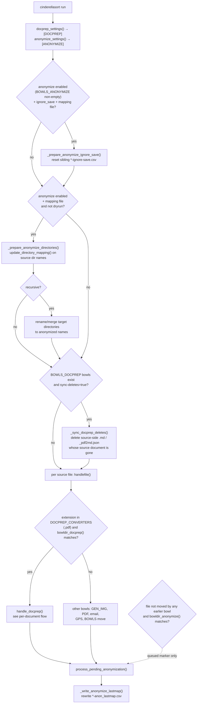
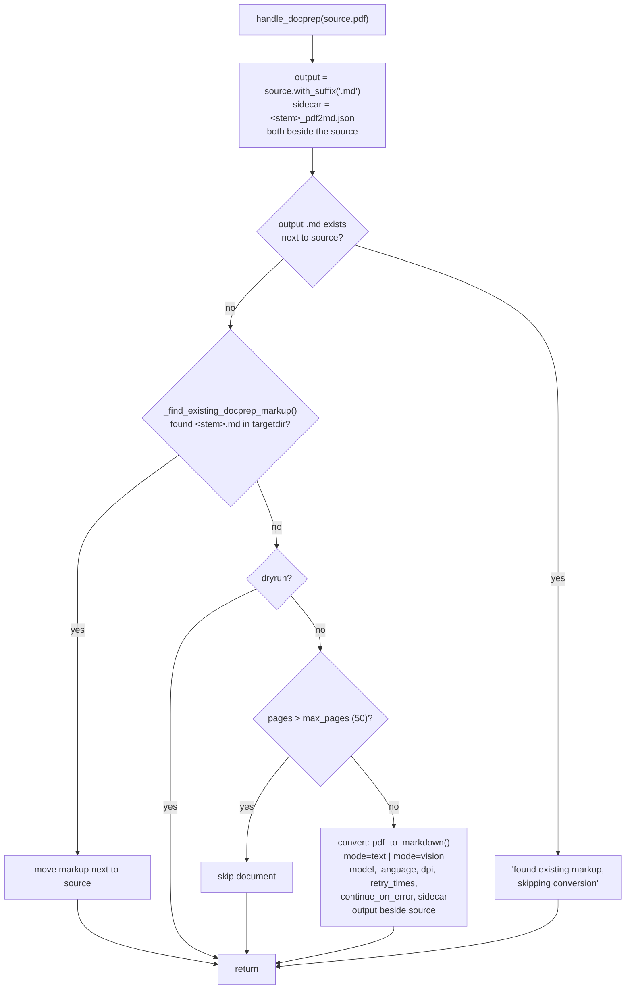
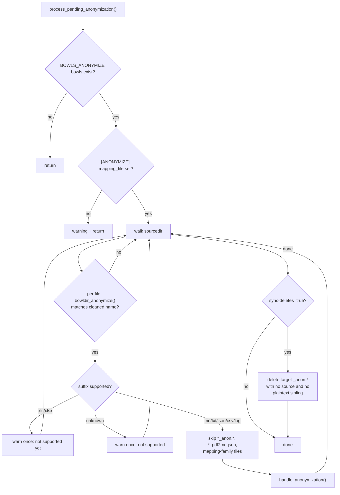
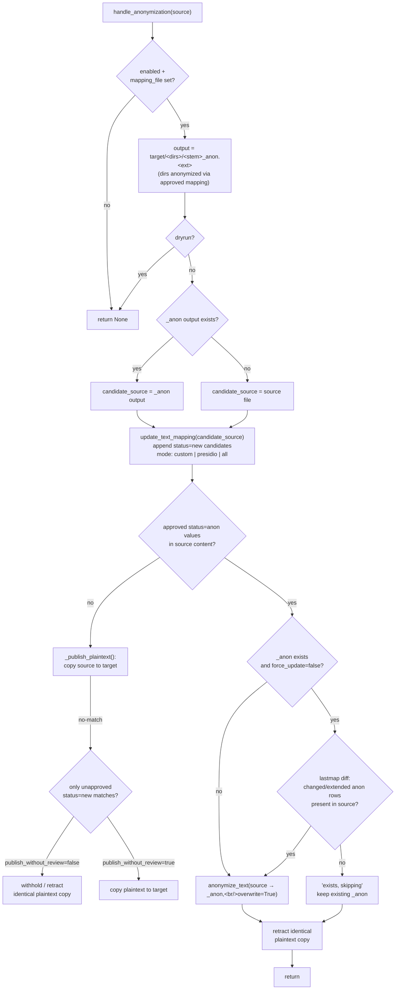

# cinderellasort — DOCPREP + ANONYMIZE flow

Flow of the `[DOCPREP]` conversion and the separate `[BOWLS_ANONYMIZE]` /
`[ANONYMIZE]` anonymization pipeline in `cinderellasort.py`, including all
decision options.

## Run-level flow

Note: a file that is moved by a regular bowl (or any earlier bowl type) is
never seen by `process_pending_anonymization` — it is gone from `sourcedir`.
Which bowl wins is decided by the fixed bowl evaluation order in
`handlefile`; this is intended.

## Per-document flow: `handle_docprep()`

DOCPREP never anonymizes. Its `.md` output becomes a normal source file that
`BOWLS_ANONYMIZE` criteria can match on the same run.

## Anonymization pass: `process_pending_anonymization()`

## Per-file flow: `handle_anonymization()`

## `[DOCPREP]` options

| Option | Default | Effect |
|---|---|---|
| `mode` | `vision` | `text` = pdfplumber text layer; `vision` = multimodal model |
| `model` | `OPENROUTER_PDF_MODEL` | vision model id |
| `language` | `en` | OCR/prompt language |
| `dpi` | `150` | render resolution (vision) |
| `max_pages` | `50` | skip larger PDFs |
| `retry_times` | `3` | model retries per page |
| `continue_on_error` | `false` | keep converting after page errors |
| `sidecar` | `true` | write `<stem>_pdf2md.json` metadata next to source |
| `sync-deletes` | `false` | delete `.md`/`_pdf2md.json` when source document is gone |

## `[ANONYMIZE]` options

Anonymization is enabled by configuring `[BOWLS_ANONYMIZE]` (criteria select
files; they do not create subdirectories) plus `[ANONYMIZE]` `mapping_file`.
There is no on/off flag.

| Option | Default | Effect |
|---|---|---|
| `mapping_file` | `<sourcedir>/<dirname>-anon-mapping.csv` | proposal mapping CSV |
| `mode` | `custom` | `custom` / `presidio` / `all` candidate detection |
| `force_update` | `false` | always rewrite existing `_anon.<ext>` |
| `sync-deletes` | `true` | delete `_anon.<ext>` when the source file is gone |
| `publish_without_review` | `false` | copy source to target even when unapproved candidates match |
| `language` | `en` | detection language |
| `presidio_model` | `de_core_news_sm` | spaCy model for presidio mode |
| `presidio_score_threshold` | `0.5` | presidio confidence cutoff |
| `presidio_entities` | built-in list (`all` = registry) | entity allow-list |
| `token_length` | `4` | deterministic replacement token length |
| `ignore_dictionary` | `false` | ignore dictionary words |
| `ignore_numbers` | `false` | ignore values containing digits |
| `ignore_emails` | `false` | ignore e-mail candidates |
| `ignore_dates` | `false` | ignore date-like candidates |
| `ignore_save` | `false` | write filtered proposals to `*-ignore-save.csv` |
| `name_countries` | — | ISO alpha-2 codes for name datasets |
| `use_name_datasets` | on when countries set | enable/disable name datasets |
| `name_cache_dir` | user cache dir | dataset cache override |
| `name_dataset_offline` | — | cache-only, no network |
| `name_dataset_debug` | `false` | dataset diagnostics |
| `name_exclusions` | — | extra single-token name exclusions |

Supported file types in ANONYMIZE bowls: `.md` (protected Markdown spans
excluded), `.txt`, `.json`, `.csv`, `.log` (whole content editable). `.xls`
and `.xlsx` log a warning until a structured adapter exists; any other
matched extension is skipped with a warning.

Notes:

- A change of docprep `mode` does not trigger re-conversion — any existing
  `.md` (paired or found in targetdir) short-circuits conversion.
- An existing `_anon.<ext>` is regenerated when `force_update=true`, or when the
  `*-anon_lastmap.csv` diff shows a changed/extended `uid` row (replacement
  or originals) that occurs in the source. `update_anonymization_lastmap`
  refreshes the snapshot after each run and reports removed rows (their
  tokens may remain orphaned in outputs).
- `*_anon.*` outputs, `*_pdf2md.json` sidecars, and the mapping family
  (mapping, `*-anon.csv`, `*-ignore*.csv`, `*_lastmap.csv`) are excluded from
  anonymize bowl processing.
